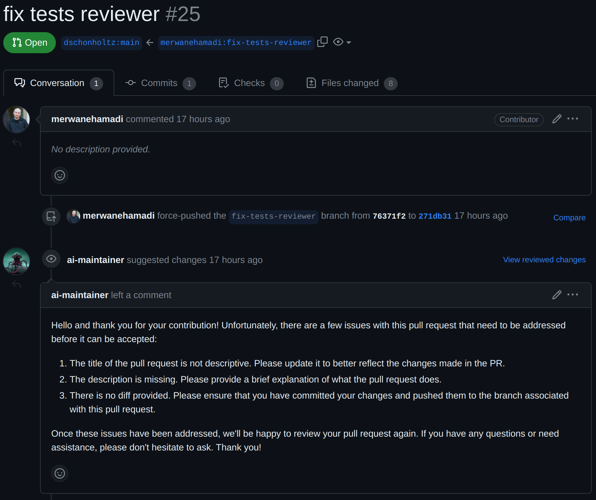

# AI-Maintainer

# What is this?
A bot to auto-review pull requests.

It requests changes or approves pull requests based on the changes made.

It runs as a server that accepts GitHub webhooks.

This project won a hackathon and you can see the NextGen Hackathon submission [here](https://nextgen-hackathon2023.bemyapp.com/#/projects/edit/6469013e5a506f28d0775d1b)

You can find our demo video here: https://www.youtube.com/watch?v=WE3UmpkMa3s

# Team

We are a team of 4 [AutoGPT](https://github.com/Significant-Gravitas/Auto-GPT) Maintainers.

We wanted to build a system that solved our problem of heavy pull request review load.

This project started as a command for AutoGPT and then was spun out into its own stand-alone project.

@dwrtz - David Wurtz
@k-nearest-neighbor Desmond Grealy
@merwanehamadi - Merwane Hamadi
@dschonholtz - Douglas Schonholtz

# Starting the server locally

run `uvicorn app:app --reload --port 8080` in the root directory

